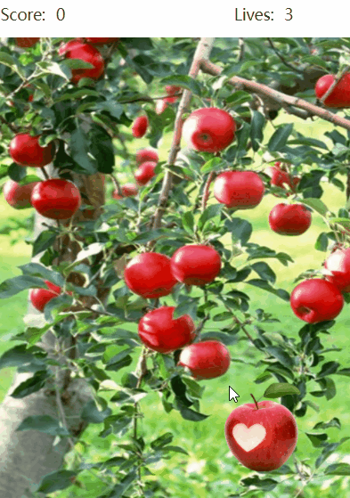
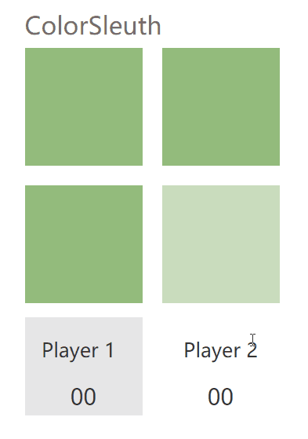
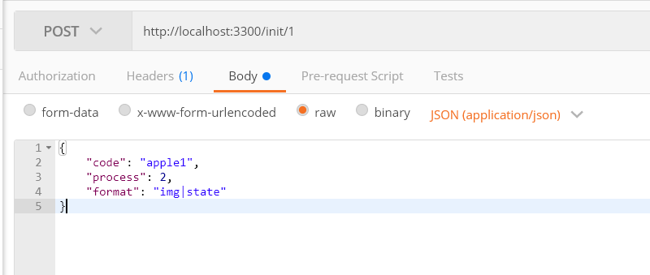
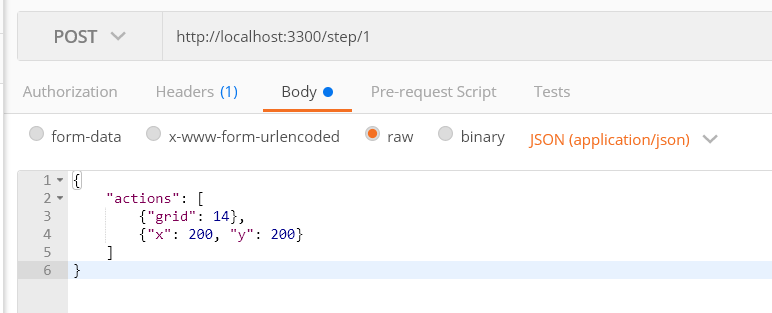
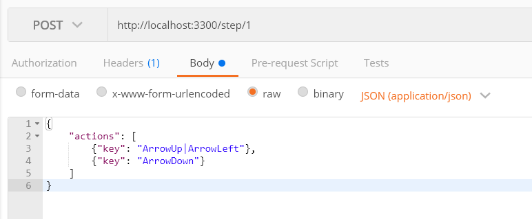
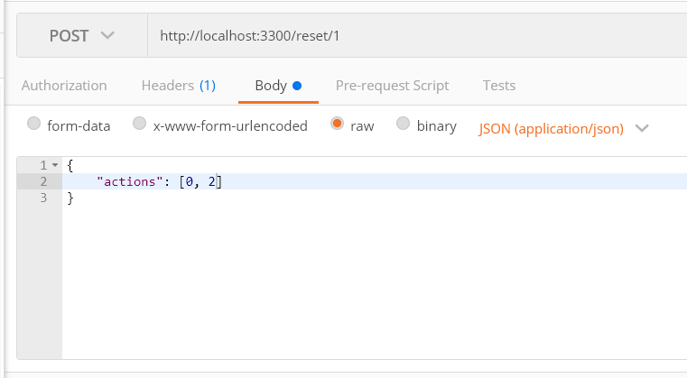
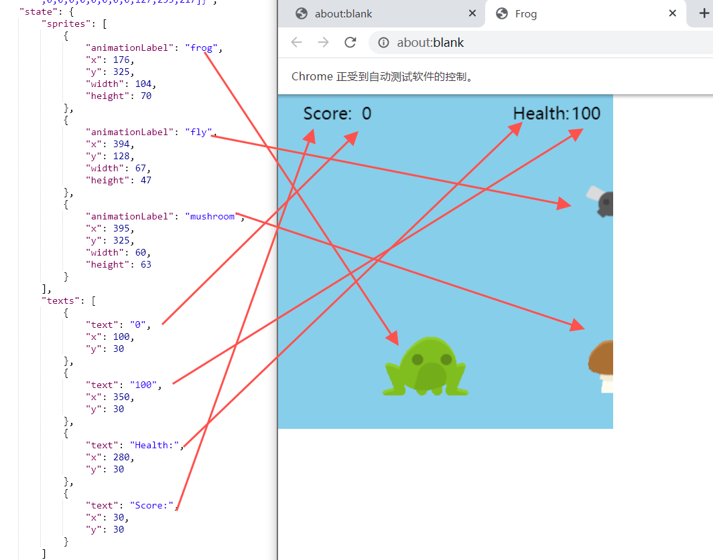

## Server
### Install dependencies

```bash
yarn install
```

### Start server

可以使用 pm2 在后台跑，也可以直接使用 node

```
pm2 start ./src/main.js
# or
yarn start
```

Options:

- -V, --version output the version number
- -p, --port <type> socket port (default: 3300)
- -o, --open close handless mode, open chrome
- -g, --game <name> game type (default: "apple")
  - apple
  - color
- -h, --help display help for command


如：起苹果 pm2 start ./src/main.js -- -g apple

起颜色侦探 pm2 start ./src/main.js -- -g color


## Client

### UserInterface

http://localhost:3300/user_interface/[:program]

如: http://localhost:3300/user_interface/apple1

我为两个游戏分别预置了一个正确答案的脚本，分别是 `apple1` 和 `color1`






### Apple/Color

#### 0. 请求方式

调用方式使用 POST，由 path 指定对应实例，详见接口示例

#### 1. init

| 参数    | 描述                                                        |
| ------- | ----------------------------------------------------------- |
| script  | 脚本内容，需经过 url 编码                                   |
| code    | 脚本文件，位于项目下的 program 文件夹，如 apple1            |
| format  | 返回值标记，img 和 state 两种，都需要用 \| 隔开，顺序不重要 |
| process | 此段脚本同时要起的网页或者说进程数                          |
| quality | 图片质量（jpeg），1-100                                     |
| frames  | 仅 frog/flyer 可用且必传，number                                                                  |

举例



这个请求的意思是初始化 ID 1 实例，使用 `./program` 下的 `apple1.js` 同时开启两个网页，且需要的返回值为图片和组件状态

`/init/1?process=2&script=abc&format=img|state`

表示初始化实例，名称为 1 (之后的接口都根据名称区分)，同时打开两个网页，返回值同时需要 图片 和 状态

返回值示例

```js
[
  // 网页 1
  {
    state: [
      {
        // 状态 id，这个游戏中苹果默认就是 apple
        id: "apple",
        // 当前在屏幕上的坐标
        x: 140,
        y: 296,
        fit: "fill",
        borderWidth: 0,
        borderColor: "#000000",
        borderRadius: 0,
        hidden: false,
        depth: 1,
      },
    ],
    img: "buffer string, jpeg 格式",
  },
  // 网页 2
  {
    // ...
  },
];
```

#### 2. step

举例

`/step/1?x=200&y=200`

点击实例 1 的所有网页的对应坐标，返回值和 init 一致

`/step/1?grid=0` (apple)

Example

##### Apple & Color:



这个请求的意思是，对 实例 1 进行下一步操作，对第一个网页点击 index 为 14 的格子（从 0 开始），对第二个网页点击坐标为 200x200 的点

`x=200&y=200`

Click coordinates on the webpage of Game 1, return value is the same as specified in init

`grid=14`

Correspond to a grid layout (Apple Grab has 4 \* 5 = 20 rectangles grid, each rectangle is 80 x 90 size, Apple's size is 100 x 100)

##### Frog & Flyer:



这个请求的意思是，对 实例 1 进行下一步操作，对第一个网页按下方向键上和方向键左（直到帧数执行完），对第二个网页按下方向键下

点击对应格子（苹果游戏 4*5 格子, 每个格子 80 * 90, 苹果大小 100 \* 100）

#### 3. reset

举例

`/reset/1`

重新初始化实例 1 的所有网页，返回值和 init 一致




图中请求的意思是重置，网页序号为 0 和 2 的网页，reset 不传参数则为重置所有网页，与 init 和 step 一样，将返回所有网页的状态

#### 4. close

举例

`/close/1`

关闭并释放实例 1 的所有网页，返回值 true

#### 5. stop

举例

`/stop`

关闭服务启的浏览器，返回值 true，关闭后其他接口均无法使用

## Return Type

Return value example

### Apple

```js
// Apple
[
  // Game Webpage 1
  {
    state: {
      components: [
        {
          // 背景
          id: "background",
          // 宽高即为窗口的宽高
          width: 320,
          height: 450,
          x: 0,
          y: 35,
          fit: "fill",
          borderWidth: 0,
          borderColor: "#000000",
          borderRadius: 0,
          hidden: false,
          depth: 0,
        },
        {
          id: "apple",
          // 苹果的大小
          width: 100,
          height: 100,
          // 随机出来的坐标
          x: 190,
          y: 335,
          fit: "fill",
          borderWidth: 0,
          borderColor: "#000000",
          borderRadius: 0,
          hidden: false,
          depth: 1,
        },
        {
          // 分数的描述文字
          id: "score_description",
          text: "Score:",
          width: 49,
          height: 19,
          x: 5,
          y: 5,
          textColor: "#333333",
          backgroundColor: "rgba(0, 0, 0, 0)",
          fontSize: 14,
          textAlign: "left",
          borderWidth: 0,
          borderColor: "#000000",
          borderRadius: 0,
          hidden: false,
          depth: 1,
        },
        {
          // 分数，text 为内容
          id: "score_label",
          text: "0",
          width: 31,
          height: 21,
          x: 55,
          y: 5,
          textColor: "#333333",
          backgroundColor: "rgba(0, 0, 0, 0)",
          fontSize: 14,
          textAlign: "left",
          borderWidth: 0,
          borderColor: "#000000",
          borderRadius: 0,
          hidden: false,
          depth: 1,
        },
        {
          // 生命值描述文字
          id: "lives_description",
          text: "Lives:",
          width: 44,
          height: 19,
          x: 215,
          y: 5,
          textColor: "#333333",
          backgroundColor: "rgba(0, 0, 0, 0)",
          fontSize: 14,
          textAlign: "left",
          borderWidth: 0,
          borderColor: "#000000",
          borderRadius: 0,
          hidden: false,
          depth: 1,
        },
        {
          // 生命值
          id: "lives_label",
          text: "3",
          width: 31,
          height: 19,
          x: 260,
          y: 5,
          textColor: "#333333",
          backgroundColor: "rgba(0, 0, 0, 0)",
          fontSize: 14,
          textAlign: "left",
          borderWidth: 0,
          borderColor: "#000000",
          borderRadius: 0,
          hidden: false,
          depth: 1,
        },
      ],
      // 苹果所在的格子
      matched: [14, 15, 18, 19],
    },
    img: "buffer string, jpeg format",
  },
  // Game Webpage 2
  {
    // ...
  },
];
```

### Color

```js
// Color 窗口大小与 apple 一致
[
  {
    // 标题
    id: "title_label",
    text: "ColorSleuth",
    width: 151,
    height: 30,
    x: 30,
    y: 10,
    borderWidth: 0,
    borderColor: "#000000",
    borderRadius: 0,
    hidden: false,
    fontSize: 25,
    textColor: "#756b6b",
  },
  {
    id: "button1",
    type: "button",
    width: 120,
    height: 120,
    x: 30,
    y: 50,
    borderWidth: 0,
    borderColor: "#000000",
    borderRadius: 0,
    hidden: false,
    backgroundColor: "rgba(208,56,149,1)",
    textColor: "#fff",
  },
  {
    id: "button2",
    type: "button",
    width: 120,
    height: 120,
    x: 170,
    y: 50,
    borderWidth: 0,
    borderColor: "#000000",
    borderRadius: 0,
    hidden: false,
    backgroundColor: "rgba(208,56,149,0.5)",
    textColor: "#fff",
  },
  {
    id: "button3",
    type: "button",
    width: 120,
    height: 120,
    x: 30,
    y: 190,
    borderWidth: 0,
    borderColor: "#000000",
    borderRadius: 0,
    hidden: false,
    backgroundColor: "rgba(208,56,149,1)",
    textColor: "#fff",
  },
  {
    id: "button4",
    type: "button",
    width: 120,
    height: 120,
    x: 170,
    y: 190,
    borderWidth: 0,
    borderColor: "#000000",
    borderRadius: 0,
    hidden: false,
    backgroundColor: "rgba(208,56,149,1)",
    textColor: "#fff",
  },
  {
    // 计分板1 的背景
    id: "player1_highlight",
    width: 120,
    height: 100,
    x: 30,
    y: 325,
    textColor: "#333333",
    backgroundColor: "rgba(197,197,197,0.408)",
    fontSize: 14,
    textAlign: "left",
    borderWidth: 0,
    borderColor: "#000000",
    borderRadius: 0,
    hidden: false,
    depth: 1,
  },
  {
    // 计分板2 的背景
    id: "player2_highlight",
    width: 120,
    height: 100,
    x: 170,
    y: 325,
    textColor: "#333333",
    backgroundColor: "rgba(197,197,197,0)",
    fontSize: 14,
    textAlign: "left",
    borderWidth: 0,
    borderColor: "#000000",
    borderRadius: 0,
    hidden: false,
    depth: 1,
  },
  {
    // player 描述文字
    id: "label4",
    text: "Player 1",
    width: 100,
    height: 25,
    x: 35,
    y: 345,
    textColor: "#333333",
    backgroundColor: "rgba(0, 0, 0, 0)",
    fontSize: 20,
    textAlign: "center",
    borderWidth: 0,
    borderColor: "#000000",
    borderRadius: 0,
    hidden: false,
    depth: 1,
  },
  {
    // player1 分数
    id: "score1_label",
    text: "00",
    type: "button",
    width: 100,
    height: 30,
    x: 40,
    y: 385,
    textColor: "#333333",
    backgroundColor: "rgba(0, 0, 0, 0)",
    fontSize: 24,
    textAlign: "center",
    borderWidth: 0,
    borderColor: "#000000",
    borderRadius: 0,
    hidden: false,
    depth: 1,
  },
  {
    // player2 描述文字
    id: "Label2",
    text: "Player 2",
    width: 100,
    height: 25,
    x: 180,
    y: 345,
    textColor: "#333333",
    backgroundColor: "rgba(0, 0, 0, 0)",
    fontSize: 20,
    textAlign: "center",
    borderWidth: 0,
    borderColor: "#000000",
    borderRadius: 0,
    hidden: false,
    depth: 1,
  },
  {
    // player2 的文字
    id: "score2_label",
    text: "00",
    type: "button",
    width: 100,
    height: 33,
    x: 180,
    y: 385,
    textColor: "#333333",
    backgroundColor: "rgba(0, 0, 0, 0)",
    fontSize: 24,
    textAlign: "center",
    borderWidth: 0,
    borderColor: "#000000",
    borderRadius: 0,
    hidden: false,
    depth: 1,
  },
];
```

### Frog

游戏屏幕大小 400 \* 400

```json
[
  {
    "img": "...",
    "state": {
      // 为游戏中所有 sprite 的矩形参数
      "sprites": [
        {
          "animationLabel": "frog",
          "x": 176,
          "y": 325,
          "width": 104,
          "height": 70
        },
        {
          "animationLabel": "fly",
          "x": 394,
          "y": 128,
          "width": 67,
          "height": 47
        },
        {
          "animationLabel": "mushroom",
          "x": 395,
          "y": 325,
          "width": 60,
          "height": 63
        }
      ],
      // 为游戏中所有 调用 text 函数的 内容
      "texts": [
        {
          "text": "0",
          "x": 100,
          "y": 30
        },
        {
          "text": "100",
          "x": 350,
          "y": 30
        },
        {
          "text": "Health:",
          "x": 280,
          "y": 30
        },
        {
          "text": "Score:",
          "x": 30,
          "y": 30
        }
      ]
    }
  }
]
```



### Flyer

游戏屏幕大小 400 \* 400

```json
[
  {
    "img": "...",
    "state": {
      // 为游戏中所有 sprite 的矩形参数
      "sprites": [
        {
          "animationLabel": "fly_bot",
          "x": 200,
          "y": 113,
          "width": 124,
          "height": 141
        },
        {
          "animationLabel": "coin",
          "x": 195,
          "y": 133,
          "width": 61,
          "height": 61
        },
        {
          "animationLabel": "rock",
          "x": 12,
          "y": 95,
          "width": 54,
          "height": 56
        },
        {
          "animationLabel": "rock",
          "x": 169,
          "y": 12,
          "width": 54,
          "height": 56
        }
      ],
      // 为游戏中所有 调用 text 函数的 内容
      "texts": []
    }
  }
]
```
