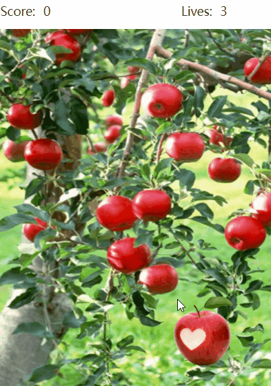
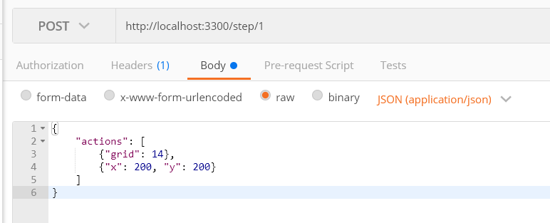
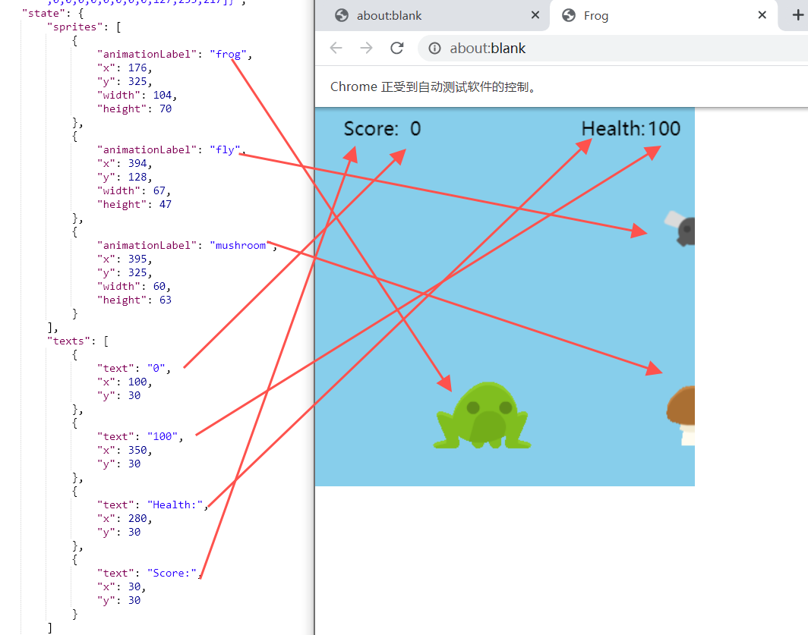

## Server

### Install dependencies

```bash
yarn install
```

### Start server

Can use pm2 to run on the backend，can directly use node as well

```
pm2 start ./src/main.js
# or
yarn start
```

Options:

- -V, --version output the version number
- -p, --port <type> socket port (default: 3300)
- -o, --open close handless mode, open chrome
- -g, --game <name> game type (default: "apple")
  - apple
  - color
  - frog
  - flyer
  - bounce
- -h, --help display help for command

Start AppleGrab game: `pm2 start ./src/main.js -- -g apple`

Start ColorSleuth: `pm2 start ./src/main.js -- -g color`

Use `-o` to enter an observation mode, where you aren't supposed to interact with keyboard/mouse, but can observe how the agent is sending actions to the game. For Flyer/Frog, the game will stay "frozen" until the next command is sent, and then it will execute for that number of frames.

## Client

### UserInterface

http://localhost:3300/user_interface/[:program]

For example: http://localhost:3300/user_interface/apple1

Programs are stored under `https://github.com/boenfu/code-org/tree/main/program/`, all stored in `.js` format. These are programs that a student could write in the Code.org interface.

There is a correct script for each game, named `apple1` `color1` `frog1` `flyer1` `bounce1`(we skip `.js` & `.json` when we pass into the browser).




### Apple/Color/Frog/Flyer/Bounce

#### 0. Request Method

Use POST request, the `path` corresponds to the game instance. See example for API usage.

#### 1. init

| Params  | Help                                                         |
| ------- | ------------------------------------------------------------ |
| script  | game program content, need URL encoding                      |
| code    | game program file name, needs to be stored under program/ folder, i.e., apple1 |
| format  | Format the return values, can have img or state, needs to seperate using \|, order doesn't matter |
| process | Specify number of concurrent processes (each is a seperate web page) |
| quality | jpeg image quality，1-100                                    |
| frames  | Only available for frog/flyer/bounce game, must be passed in. Run X number of frames before return. integer value. |

Example


This request means to initialize Instance ID 1; use `apple1.js` from `./program`. Open two web pages (tabs/windows), and set the reutrn value to be images and status of game objects.

#### 2. step

Example

##### Apple & Color:



This request means: conduct the next step actions on Instance ID 1. For the 1st web page (or 1st process), click the rectangle index 14 (starting from 0), and click (200, 200) point in the second webpage.

`x=200&y=200`

Click coordinates on the webpage of Game 1, return value is the same as specified in init

`grid=14`

Correspond to a grid layout (Apple Grab has 4 \* 5 = 20 rectangles grid, each rectangle is 80 x 90 size, Apple's size is 100 x 100)

##### Frog & Flyer:


This request means: conduct the next step actions on Instance ID 1. For the first web page (1st process), click both arrowup and arrowleft (for the number of frames specified in the init), and for the second web page (2nd process), press arrowdown.

`key=ArrowUp`

Execute number of frames passed in during init annd "press" "ArrowUp". When no key is passed (i.e., player not pressing any key), the game will only execute number of frames.

> We allow multiple keys pressed at once, use `|` to seperate them, such as `ArrowUp|ArrowLeft`

#### 3. reset

Example


The request in the screenshot is to reset the webpage process index 0 and 2 (assuming there are 3 processes). If no index/parameter is passed to reset, it will reset ALL processes (webpages). Similar to init and step, reset will return the states of all webpages (processes) under the instance.

Reset all webpages of Instance 1, return values are the same as init

#### 4. close

Example

`/close/1`

Close and release all webpages of Instance 1, return true.

#### 5. stop

Example

`/stop`

Close the browser server, return true, after closing, all other APIs will not be available.

## Return Type

Return value example

### Apple

```js
// Apple
[
  // Game Webpage 1
  {
    img: "headless base64 image jpeg format",
    state: {
      components: [
        {
          // Background
          id: "background",
          // The game window's width and height
          width: 320,
          height: 450,
          x: 0,
          y: 35,
          fit: "fill",
          borderWidth: 0,
          borderColor: "#000000",
          borderRadius: 0,
          hidden: false,
          depth: 0,
        },
        {
          id: "apple",
          // apple's size
          width: 100,
          height: 100,
          // randomly generated coordinates
          x: 190,
          y: 335,
          fit: "fill",
          borderWidth: 0,
          borderColor: "#000000",
          borderRadius: 0,
          hidden: false,
          depth: 1,
        },
        {
          // Description for game score
          id: "score_description",
          text: "Score:",
          width: 49,
          height: 19,
          x: 5,
          y: 5,
          textColor: "#333333",
          backgroundColor: "rgba(0, 0, 0, 0)",
          fontSize: 14,
          textAlign: "left",
          borderWidth: 0,
          borderColor: "#000000",
          borderRadius: 0,
          hidden: false,
          depth: 1,
        },
        {
          // Score，"text" is the score itself
          id: "score_label",
          text: "0",
          width: 31,
          height: 21,
          x: 55,
          y: 5,
          textColor: "#333333",
          backgroundColor: "rgba(0, 0, 0, 0)",
          fontSize: 14,
          textAlign: "left",
          borderWidth: 0,
          borderColor: "#000000",
          borderRadius: 0,
          hidden: false,
          depth: 1,
        },
        {
          // 生命值描述文字
          id: "lives_description",
          text: "Lives:",
          width: 44,
          height: 19,
          x: 215,
          y: 5,
          textColor: "#333333",
          backgroundColor: "rgba(0, 0, 0, 0)",
          fontSize: 14,
          textAlign: "left",
          borderWidth: 0,
          borderColor: "#000000",
          borderRadius: 0,
          hidden: false,
          depth: 1,
        },
        {
          // Number of lives left
          id: "lives_label",
          text: "3",
          width: 31,
          height: 19,
          x: 260,
          y: 5,
          textColor: "#333333",
          backgroundColor: "rgba(0, 0, 0, 0)",
          fontSize: 14,
          textAlign: "left",
          borderWidth: 0,
          borderColor: "#000000",
          borderRadius: 0,
          hidden: false,
          depth: 1,
        },
      ],
      // the rectangles in the grid that the apple occupies
      matched: [14, 15, 18, 19],
    }
  },
  // Game Webpage 2
  {
    // ...
  },
];
```

### Color

```js
// Color window size is the same as Apple Grab
[
  {
    img: "无头 base64 图片 jpeg 格式",
    state: [
      {
        // Game Title
        id: "title_label",
        text: "ColorSleuth",
        width: 151,
        height: 30,
        x: 30,
        y: 10,
        borderWidth: 0,
        borderColor: "#000000",
        borderRadius: 0,
        hidden: false,
        fontSize: 25,
        textColor: "#756b6b",
      },
      {
        id: "button1",
        type: "button",
        width: 120,
        height: 120,
        x: 30,
        y: 50,
        borderWidth: 0,
        borderColor: "#000000",
        borderRadius: 0,
        hidden: false,
        backgroundColor: "rgba(208,56,149,1)",
        textColor: "#fff",
      },
      {
        id: "button2",
        type: "button",
        width: 120,
        height: 120,
        x: 170,
        y: 50,
        borderWidth: 0,
        borderColor: "#000000",
        borderRadius: 0,
        hidden: false,
        backgroundColor: "rgba(208,56,149,0.5)",
        textColor: "#fff",
      },
      {
        id: "button3",
        type: "button",
        width: 120,
        height: 120,
        x: 30,
        y: 190,
        borderWidth: 0,
        borderColor: "#000000",
        borderRadius: 0,
        hidden: false,
        backgroundColor: "rgba(208,56,149,1)",
        textColor: "#fff",
      },
      {
        id: "button4",
        type: "button",
        width: 120,
        height: 120,
        x: 170,
        y: 190,
        borderWidth: 0,
        borderColor: "#000000",
        borderRadius: 0,
        hidden: false,
        backgroundColor: "rgba(208,56,149,1)",
        textColor: "#fff",
      },
      {
        // Score board 1's background
        id: "player1_highlight",
        width: 120,
        height: 100,
        x: 30,
        y: 325,
        textColor: "#333333",
        backgroundColor: "rgba(197,197,197,0.408)",
        fontSize: 14,
        textAlign: "left",
        borderWidth: 0,
        borderColor: "#000000",
        borderRadius: 0,
        hidden: false,
        depth: 1,
      },
      {
        // Score board 2's background
        id: "player2_highlight",
        width: 120,
        height: 100,
        x: 170,
        y: 325,
        textColor: "#333333",
        backgroundColor: "rgba(197,197,197,0)",
        fontSize: 14,
        textAlign: "left",
        borderWidth: 0,
        borderColor: "#000000",
        borderRadius: 0,
        hidden: false,
        depth: 1,
      },
      {
        // player description text
        id: "label4",
        text: "Player 1",
        width: 100,
        height: 25,
        x: 35,
        y: 345,
        textColor: "#333333",
        backgroundColor: "rgba(0, 0, 0, 0)",
        fontSize: 20,
        textAlign: "center",
        borderWidth: 0,
        borderColor: "#000000",
        borderRadius: 0,
        hidden: false,
        depth: 1,
      },
      {
        // player1 score
        id: "score1_label",
        text: "00",
        type: "button",
        width: 100,
        height: 30,
        x: 40,
        y: 385,
        textColor: "#333333",
        backgroundColor: "rgba(0, 0, 0, 0)",
        fontSize: 24,
        textAlign: "center",
        borderWidth: 0,
        borderColor: "#000000",
        borderRadius: 0,
        hidden: false,
        depth: 1,
      },
      {
        // player2 description text
        id: "Label2",
        text: "Player 2",
        width: 100,
        height: 25,
        x: 180,
        y: 345,
        textColor: "#333333",
        backgroundColor: "rgba(0, 0, 0, 0)",
        fontSize: 20,
        textAlign: "center",
        borderWidth: 0,
        borderColor: "#000000",
        borderRadius: 0,
        hidden: false,
        depth: 1,
      },
      {
        // player2 description text
        id: "score2_label",
        text: "00",
        type: "button",
        width: 100,
        height: 33,
        x: 180,
        y: 385,
        textColor: "#333333",
        backgroundColor: "rgba(0, 0, 0, 0)",
        fontSize: 24,
        textAlign: "center",
        borderWidth: 0,
        borderColor: "#000000",
        borderRadius: 0,
        hidden: false,
        depth: 1,
      },
    ],
  },
];
```

### Frog

Game screen size: 400 \* 400

```json
[
  {
    "img": "无头 base64 图片 jpeg 格式",
    "state": {
      // All of the rectangle sprites in game
      "sprites": [
        {
          "animationLabel": "frog",
          "x": 176,
          "y": 325,
          "width": 104,
          "height": 70
        },
        {
          "animationLabel": "fly",
          "x": 394,
          "y": 128,
          "width": 67,
          "height": 47
        },
        {
          "animationLabel": "mushroom",
          "x": 395,
          "y": 325,
          "width": 60,
          "height": 63
        }
      ],
      // All of the content created by text() function call
      "texts": [
        {
          "text": "0",
          "x": 100,
          "y": 30
        },
        {
          "text": "100",
          "x": 350,
          "y": 30
        },
        {
          "text": "Health:",
          "x": 280,
          "y": 30
        },
        {
          "text": "Score:",
          "x": 30,
          "y": 30
        }
      ]
    }
  }
]
```



### Flyer

Screen size 400 \* 400

```json
[
  {
    "img": "无头 base64 图片 jpeg 格式",
    "state": {
      // All of the rectangle sprites in game
      "sprites": [
        {
          "animationLabel": "fly_bot",
          "x": 200,
          "y": 113,
          "width": 124,
          "height": 141
        },
        {
          "animationLabel": "coin",
          "x": 195,
          "y": 133,
          "width": 61,
          "height": 61
        },
        {
          "animationLabel": "rock",
          "x": 12,
          "y": 95,
          "width": 54,
          "height": 56
        },
        {
          "animationLabel": "rock",
          "x": 169,
          "y": 12,
          "width": 54,
          "height": 56
        }
      ],
      // All of the content created by text() function call
      "texts": []
    }
  }
]
```

### Bounce

```json
[
    {
        "state": {
            "sprites": [
                {
                    "animationLabel": "hardcourt_paddle",
                    "x": 74,
                    "y": 372,
                    "width": 44,
                    "height": 18
                },
                {
                    "animationLabel": "hardcourt_ball",
                    "x": 181.32096571026318,
                    "y": 182,
                    "width": 28,
                    "height": 28
                }
            ],
            "scores": [
                // score point
                0,
                // score opponent point
                0
            ]
        }
    }
]
```

